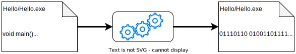

# EDUBE C Programming Language Professional Certificate


<!--toc:start-->
- [EDUBE C Programming Language Professional Certificate](#edube-c-programming-language-professional-certificate)
  - [C Essentials - Part 1 (Basics)](#c-essentials-part-1-basics)
    - [Module 1](#module-1)
      - [Compilation](#compilation)
      - [Your First Program](#your-first-program)
        - [Output](#output)
      - [LAB 1.1 - What is your name?](#lab-11-what-is-your-name)
        - [Level of difficulty](#level-of-difficulty)
        - [Objectives](#objectives)
        - [Scenario](#scenario)
        - [Solution](#solution)
      - [LAB 1.2 - Just Numbers - Part 1](#lab-12-just-numbers-part-1)
        - [Level of difficulty](#level-of-difficulty)
        - [Objectives](#objectives)
        - [Scenario](#scenario)
        - [Expected output](#expected-output)
        - [Solution](#solution)
      - [Numbers and how the computers see them](#numbers-and-how-the-computers-see-them)
      - [Variables](#variables)
        - [Names](#names)
        - [Types](#types)
        - [Creating a variable](#creating-a-variable)
      - [Comments in C](#comments-in-c)
    - [Module 2](#module-2)
      - [Floating-point Numbers](#floating-point-numbers)
      - [Scientific Notation](#scientific-notation)
      - [Operators](#operators)
    - [Module 3](#module-3)
    - [Module 4](#module-4)
    - [Module 5](#module-5)
    - [Part 1 Test](#part-1-test)
  - [C Essentials - Part 2 (Intermediate)](#c-essentials-part-2-intermediate)
  - [C Advanced](#c-advanced)
<!--toc:end-->
## C Essentials - Part 1 (Basics)

<div style="text-align: justify">

The C Essentials - Part 1 (BASICS) course will prepare you for the CLE (C Certified Entry-Level Programmer) and CLA (C Programming Language Certified Associate) exams. The course covers the basics of programming in the C programming language and touches on fundamental programming techniques, customs and vocabulary, including the most common library functions. The aim of the course is to familiarize the student with the basic concepts of computer programming and developer tools, present the syntax, semantics and data types offered by the language, and allow the student to write his or her own programs using standard language infrastructure, regardless of the hardware or software platform. The course is designed for beginners. No prior knowledge of programming is required.

</div>

### Module 1

#### Compilation

<div style="text-align: justify">

The translation we are referring to is made by a specialized computer program called a compiler. The process of translating from a high-level language into a machine language is called compilation. Now let's get back to more interesting issues related to the process of creating a new program. We already know that the main task is to write a program in accordance with the rules of the chosen programming language. Such a program (which in fact is just text) is called the source code, or simply source, while the file which contains the source is called the source file.

To write the source code you need a text editor that allows you to manipulate text without any formatting information (for this reason Microsoft Word isn't a good choice, in contrast to the Notepad). This code is placed in a file and th ename of the file should give you some clue as to its content. For example, it’s common for a file containing the source code in the “C“ language to have its name ending with the suffix “.c”, so if you wrote a computer program and decided to name it "proggie" it would be a good idea to put the source code into a file named “proggie.c”.

Next, your source code needs to be compiled. To do this you run a compiler, instructing it where you stored the source code that you want to be translated into machine language. The compiler reads your code, does some complex analysis and its first goal is to determine whether or not you made any errors during the coding. These analyses are very insightful, but remember that they are made by a machine, not a human, and you shouldn’t expect too much from them. OK, if your mistake was that you tried to add up two numbers using “#” instead of “+”, the compiler will kindly inform you of your error.

However, if you typed a "-" instead of a "+", the compiler will no longer be able to guess that your intention was to add two numbers, rather than to subtract them. Do not expect the compiler to think for you. But there’s no reason to be sad about it – thanks to that, developers are still needed.

If the compiler doesn’t notice any mistakes in your source, the result of its work will be a file containing your program translated into machine language. That file is commonly called an executable file. The name of the file depends on the compiler you use and the operating system you’re working with. For example, most compilers designed for the Unix/Linux system create an output file named “a.out” by default. Compilers designed for use in MS Windows® can give this file the same name as the source file, only changing the suffix from “.c” to “.exe”.

<center>

</center>

We must admit that the whole process is actually a bit more complicated. Your source code might be comprehensive and divided among several or even dozens of source files. It may also happen that the program was not written by you alone, but by a team, in which case the division of sources into multiple files is simply a must. In such cases, the compiling splits into two phases – a compilation of your source, in order to translate it into machine language, and a joining (or gluing) of your executable code with the executable code derived from other developers into a single and unified product. The phase of “gluing” the different executable codes is commonly known as linking while the program which conducts the process is called a linker.
A few words about C

The “C” language is one of a huge number of programming languages currently in use, and one of the oldest. It was created in the early seventies of the twentieth century by Dennis Ritchie while he was working in Bell Laboratories. Some say that “C” was a by-product of a project which led to the very first version of the Unix operating system. There are many other programming languages widely used – some of them could be regarded as “C” descendants. They even inherited a name from their ancestor – like “C++” or “C#”. Others borrowed some features from the original “C” and added lots of new ones – like Perl, Java or JavaScript.

What is the most common use of “C”? It is the so-called general-purpose programming language, i.e., suitable for almost any programming project and at the same time not particularly predestined to any specific, narrow class of applications. It’s best if used for coding drivers, embedded applications or operating systems (for example, the Linux kernel is mainly coded in “C”). You can also use it for building complex utilities. We can assure you that knowing the “C” language is very helpful if you want to learn C++, C# or Java.

We guarantee you that the time you spend learning the “C” language won't be wasted.

#### Your First Program

Your first program

Now we’d like to show you a very simple (and completely useless) program written in the “C” language. Using this example, we’ll show you some basic rules as we modify the program many times, enriching it with various elements and simultaneously expanding our programming knowledge.

First, we define our expectations for the program. They’ll be very modest. We want a short and rather meaningless text to appear on the screen. Let's assume that the text should proclaim to the world:
It's me, your first program.

##### Output

We don't expect anything more from it so far.

What further steps should our first program perform? Let's try to enumerate them here:

- to start;
- to write the text on the screen;
- to stop

This sort of structured and semi-formal description of each step of the program is called an algorithm. The sources of this word can be traced back to the Arabic language, and it originated in early medieval times, which may be the pretext to note that the beginnings of computer programming lie in very ancient times.

Now it's time to see our program. It’s on the right side of the screen, in the editor.

It looks a bit mysterious, doesn't it? Now we’ll look carefully at each line of the program, explaining its meaning and purpose. The description is not particularly accurate and those who know the “C” language would probably already conclude that it’s too simplistic and somewhat childish. We did this on purpose – it’s not our intention to build Rome in a day.

Let's start.

```C
#include <stdio.h>

int main(void)
{
 puts("It's me, your first program.");
    return 0;
}
```

Pay attention to the character `#` (hash) at the beginning of the first line. It means that the content of this line is a preprocessor directive. We’re going to tell you more about the preprocessor a little bit later, but for now we’ll just say that it’s a separate part of the compiler, whose task is to pre-read the text of the program and make some modifications to it. The prefix “pre” suggests that these operations are performed before the full processing (compilation) takes place.

The changes the preprocessor introduces are controlled entirely by its directives. In the example program, we’re dealing with the include directive. When the preprocessor encounters that directive, it replaces the directive with the content of the file whose name is listed in the directive (in our case, this is the file `stdio.h`). Note – the changes made by the preprocessor never modify the content of your source file in any way. Any alterations are made on a volatile copy of your program, which disappears immediately after the compiler finishes its work.

You may ask why we want the preprocessor to include the content of a completely unknown file `stdio.h`. Writing a program is similar to constructing a building with ready-made blocks. In our program, we’re going to use such a block and we’ll use it when we want to write something on the screen. That block is called puts (you can find it inside our code), but the compiler knows nothing about it so far. In particular, the compiler has no idea that puts is a valid name for that block while puts isn't. The compiler needs to be aware of this. This preliminary information needed by the compiler is included in the files whose names usually end with `“.h”` (header). These files are commonly called header files.

The `stdio.h` file (defined by the standard of the “C” language) contains a collection of preliminary information about ready-made blocks which can be used by a program to write text on the screen or to read letters from the keyboard. So when our program is going to write something, it’ll obviously use a block called puts, which is able to do the trick. We don't want the compiler to be surprised, so we must warn it about that. The compiler's developers put a set of such anticipatory information in the stdio.h file. We only have to use the file. This is exactly what we expect from the include directive.

You might also ask where the `stdio.h` file is located. The answer is simple but not as accurate as you may want – but that’s not our problem right now. The preprocessor knows where it is. We’ll return to the issue when we begin the detailed story of preprocessing.

Every function in “C” begins with the following set of information:

- What is the **result** of the function?
- What is the **name** of the function?
- How many **parameters** does the function have and what are their names?
- The **result** of the function is an **integer** value (we read it from the word `int` which is short for **integer**)
- the **name** of the function is `main` (we know why already)
- the function doesn't require any **parameters** (which we read from the word `void`)

A set of information like this is sometimes called a `prototype`, and it’s like a label affixed to a function, announcing how we can use that function in your program. The prototype says nothing about what the function is intended for. It’s written inside the function and the interior of the function is called the **function body**. The function body begins where the first opening bracket `{` is placed and ends where the corresponding closing bracket `}` is placed. It might sound surprising, but the function body can be empty – this just means that the function does nothing.

We can even imagine a function that is lazy – it would be encoded like this:

```C
void lazy(void) { }
```

This drone provides no result (the first `void`), its name is `lazy`, it doesn't take any parameters (the second `void`) and it does absolutely nothing (the blank space between the brackets).

Inside the main function body we should write what our function (and thus the program) is supposed to do. We look inside and find a reference to a block called `puts`. This is what we call a **function invocation**. Now let’s consider a few important details.

Firstly, note the `semicolon` at the end of the line. Each instruction (precisely: each statement) in “C” must end with a `semicolon` – without it the program will be incorrect. A statement like this says: instruct the function named `puts` to show text on the screen.

You might ask – how do we know that the `puts` function will do that for us? Well, we know it from the “C” language standards, but also, the name of the function is an abbreviation of `“PUT String”`. The text intended to be shown on the screen is passed to the function as a function parameter. Remember that the name of the invoked function must always be followed by a pair of parentheses `(` and `)`, even when the function doesn’t expect any parameters from us.

Secondly, the parameter of the function `puts` is text (`string`). For simplicity, we can assume that strings in a program in “C” are always enclosed in quotes – in that way the compiler distinguishes the text that is sent to the user of the program and the text intended to be compiled (translated into machine language). This distinction is very important. Take a look:

```C
int main(void);

```

The line above is the main function prototype.

We’re coming to the end now. There’s only one line left to explain in our program. This is:

```C
return 0;
```

Besides the function invocation, this is another statement of the “C” language. Its name is just `return` and that’s exactly what it does. Used in the function, it causes the end of the function execution. If you perform return somewhere inside a function, this function immediately **interrupts** its execution. The `zero` that you see after the word `return` is the result of your function `main`. This is important – this is how your program tells the operating system the following message: I did what I had to do, nothing stopped me and everything is OK. If you were to write:

```C
return 1;
```

it would mean that something had gone wrong, it didn’t allow your program to be successful and the operating system could then use that information to react in the most appropriate way.

Is that all? Yes! Let's look again at our program and see what’s happening step by step:

- we introduce the function `main` into our program – it’ll be executed when you start the program;
- we invoke the function `puts` inside the main function – it’ll print the text on the screen;
- the program finishes immediately after printing, indicating that everything you expected to achieve has been achieved.

</div>

#### LAB 1.1 - What is your name?

##### Level of difficulty

Very Easy

##### Objectives

Familiarize the student with:

- Writing a first program
- Printing on screen
- The main function

##### Scenario

Write your first program in the "C" language. Just print your name 3 times. Remember to include a `return` statement and make proper use of the `main` function.

##### Solution

[C1-1.c](/src/C1/src/c1-1.c)

#### LAB 1.2 - Just Numbers - Part 1

##### Level of difficulty

Easy

##### Objectives

Familiarize the student with:

- Fixing errors in a program
- Integer numbers
- Printing on screen

##### Scenario

Find all possible compilation errors and logic errors. Fix them.

Your version of the program must print the same result as the expected output. Before you use the compiler, try to find the errors only by manual code analysis.

##### Expected output

`The value of five is: 5`

##### Solution

[C1-1.c](/src/C1/src/c1-2.c)

#### Numbers and how the computers see them

<div style="text-align: justify">

The numbers handled by modern computers are of two types:

- `integers (int)`: those which are devoid of a fractional part;
- `floating-point (float)`: also known as `floats`, are numbers that contain a fractional part.

Both of these two types of numbers significantly differ in how they are stored in memory and the range of acceptable values. Furthermore, the characteristic of a number which determines its kind, range and application is called a **type**.

`int`s are represented almost the same way you're used to writing in paper - it;s simply a **string of digits** that make up the number. But there's a reservation - you must not insert any characters that are not digits inside the number. Take for example the number **eleven million on hundred and eleven thousand one hundred and eleven**. If you took a pencil and wrote it, it would look like this `11,111,111` or `11.111.111`. But in `C` it must be written like this: `11111111`. Otherwise you'd expose yourself to some bitting remarks from the compiler.

To write negative numbers you add a `-` symbol at the front of it, a usual: `-11111111`. Positive numbers do not require a `+` symbol at the front, but you may put it, if you like.

There are two additional conventions, unknown to the world of mathematics:

- **Octal Representation**: `int`s are octal if preceded by the `0` digit. This means that the number must contain digits taken from the `[0...7]` range only. For example: `0123` is an octal number with a decimal value equal to `83`.

- **Hexadecimal Representation**: `int`s are hexadecimal if they're preceded by an `0x`. As such, `0x123` is a hexadecimal representation with a decimal value equal to `291`.

To print an integer number, you should use (for a simple format):

```C
printf("%d\n", IntegerNumberOrExpression);
```

To print a floating-point number, you should use (for a simple format):

```C
printf("%f\n", FloatNumberOrExpression);
```

In both cases, you should first include the `stdio.h` header file.

</div>

#### Variables

<div style="text-align: justify">

##### Names

A **variable** is a **container** for values that may be changed in value. Variables have rules regarding their naming:

- The name of the variable must be composed of **upper-case** or **lower-case** **Lating letters, digits and the underscore character** `_`;
- The name of the variable **MUST** begin with a letter;
- The underscore character is considered a letter;
- Upper and lower-case letters are treated as **different**. Which means that it is **case-sensitive**;
- The same restriction apply to **FUNCTION NAMES**;
- The restriction on the variable name length is **compiler-based**, but usually you'd want to avoid long names.

##### Types

The `C` language is a statically-typed language, which means that variables have a type, such as `int` and `float` and the variables may only store these kind of values. It is not possible to change it mid-execution or assign a `float` value to an `int` variable or vice-versa.

##### Creating a variable

A variable comes into existence as a result of a **declaration**. A declaration is a syntatic structure that binds a name, provided by the programmer, to a specific type offered by the `C` language. The construction of the declaration, in other words, the declaration syntax, is simple: just use the name of the desired type, then the variable name or names separated by commas if there are more than one. The whole statement ends with a semicolon.

</div>

#### Comments in C

<div style="text-align: justify">

The developer may want to put in a few words addressed not to the compiler but to humans, usually to **explain** to other readers of the code how the tricks used in the code work, or the meanings of variables and functions and evetually, in order to keep stored information on who the author is and when the program was written.

Good an responsible developrs describe each function; in particular, they explain the role of the parameters, the value the function returns as a result and what the function actually does.

To leave these traces in the program in a way that the compiler won't interpret as part of the code we use what is called _comments_. Whenever the compiler encouters a comment in your program, the comment is completely transparent to it.

In the `C` language a comment is a text that begins with a pair of characters:

```C
/*
```

and ends with the pair of characters:

```C
*/
```

The comment can span several lines or it can occupy a single line or only a part of it. As an example:

```C
/* Counter variable counts the number of sheep in the meadow */
int Counter;
```

Any developer reading the program will be aware of the true meaning of the variable `Counter`. The developer will read the code faster and it will take less time to understand it.

Developers often place a note at the beginning of the source informing us of when they wrote the program, and who amended it and why. The note may appear like this:

```C
/*************************************************
Counting sheep version 1.0
Author: Ronald Sleepyhead, 2012
email: rs@insomnia.org

Changes:
2012-09-13: Ginny Drowsy: counting black sheep improved
*************************************************/
```

Despite the complicated structure and the multitude of stars, the condition saying how the comment should be started and finished is fully met.

Comments may also be used to render some part of a code that is currently not needed, for whateer reason. We often do this during the testing of a program in order to isolate the place where an error might be hidden.

</div>

### Module 2

#### Floating-point Numbers

Numbers that have a fractional part, such as `0.4`. As a side note, you can omit zero when it's the only digit in front of or after the decimal point. In essence, you can write `0.4` as `.4` and it works flawlessly.

```C
4
4.0
```

Those numbers above may look exactly the same to you, but the `C` Compiler sees them as two completely different values.

- `4` is an `int` and it represented an integer, a whole number;
- `4.0` is a `double`, which means it represents double-precision floating-point number, they have fifteen decimal digits of precision and can be easily assigned to `float`s (single-precision floating-point numbers which have six decimal digits of precision);
- We can say that the **point makes a double**. Do not forget that.

#### Scientific Notation

Say you want to represent gigantic numbers, such as the speed of light. To avoid tediously writing so many zeroes you may use the scientific notation, such as `3*10^8`. In C this is represented as

```C
3E8
```

The letter `E` (which you can also use the lower-case version, `e`, comes from the word _exponent_) is a concise version of the phrase "times ten to the power of". Take note that:

- The exponent (value after `E`) **must** be an integer;
- The base (value in front of `E`) **can** be an integer.:w

To represent numbers that are very small you may use `E-N`, be it N an integer. For example, the **Planck's Constant** is represented as

```C
6.62607E-34
```

#### Operators

An

### Module 3

### Module 4

### Module 5

### Part 1 Test

## C Essentials - Part 2 (Intermediate)

<div style="text-align: justify">

</div>

## C Advanced

<div style="text-align: justify">

</div>
